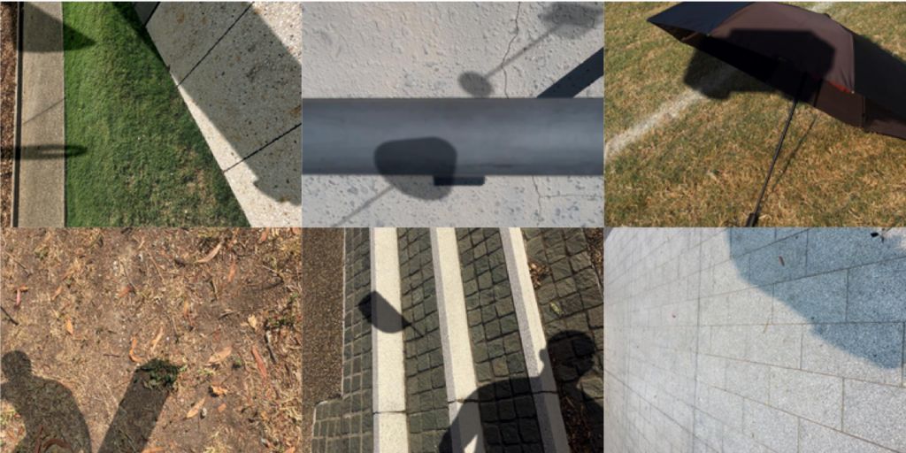

# Learning from Synthetic Shadows for Shadow Detection and Removal (IEEE TCSVT 2021)

## Overview
This repo is for the paper "[Learning from Synthetic Shadows for Shadow Detection and Removal](https://arxiv.org/abs/2101.01713)". We present SynShadow, a novel large-scale synthetic shadow/shadow-free/matte image triplets dataset and pipeline to synthesize it. We further show how to use SynShadow for robust and efficient shadow detection and removal.



In this repo, we provide
- SynShadow dataset: `./datasets`
- [SP+M](https://arxiv.org/abs/1908.08628) implementation: `./src`
- Trained models and results: below

If you find this code or dataset useful for your research, please cite our paper:

```
@article{inoue2021learning,
  title={{Learning from Synthetic Shadows for Shadow Detection and Removal}},
  author={Inoue, Naoto and Yamasaki, Toshihiko},
  journal={IEEE Transactions on Circuits and Systems for Video Technology},
  year={2021},
  volume={31},
  number={11},
  pages={4187-4197},
  doi={10.1109/TCSVT.2020.3047977}
}
```


## Trained Models and Results
We provide the models for shadow detection and removal for convenience. Downloaded models should be placed under `./checkpoints`.

### Shadow Detection
ALl the results are in 480x640. BER is reported for 480x640 images. Below are results evaluated on ISTD test set. DSDNet++ is a modified variant of [DSDNet](https://openaccess.thecvf.com/content_CVPR_2019/html/Zheng_Distraction-Aware_Shadow_Detection_CVPR_2019_paper.html).

| Model | Train | BER |      |
|  :-:  |   :-:    | :-: | :-:  |
|DSDNet++|SynShadow|2.74|[results](https://drive.google.com/file/d/1jhVXHSHj4teacLTK_I-Ep4WNDxId-_tp/view?usp=drive_link) / [weights](https://drive.google.com/file/d/13IhP8d5Tb7ZM3kgu0HmgAvSxAS0KMtXZ/view?usp=drive_link)|
|DSDNet++|SynShadow->ISTD|1.09|[results](https://drive.google.com/file/d/14Ni8fEoQJNj1xz2e_JD1zUKSWwuuwcxc/view?usp=drive_link) / [weights](https://drive.google.com/file/d/1CQ6KjDlKesdb86tJnVcX79B3br_w5jHt/view?usp=drive_link)|
|BDRAR|SynShadow|2.74|[results](https://drive.google.com/file/d/1IHTf0901Mzm5a2G1sROfAyJYoddFNVbF/view?usp=drive_link) / [weights](https://drive.google.com/file/d/1y-VQBoclNzPsfBZovMwpymlVb4I3ljVy/view?usp=drive_link)|
|BDRAR|SynShadow->ISTD|1.10|[results](https://drive.google.com/file/d/1Pr7iAxPsjdZMwwEv7aZ54eiw7GMVoEsS/view?usp=drive_link) / [weights](https://drive.google.com/file/d/1pLZr8uRfnPVkUzI3f7Yx0smcNN2W0l0N/view?usp=drive_link)|

### Shadow Removal
ALl the results are in 480x640. For the pre-trained weights, we only provide SP+M weights, since this repository has full implementation of it. RMSE is reported for 480x640 images.

Model: [SP+M](https://arxiv.org/abs/1908.08628)
| Train | Test | RMSE |      |
| :-: | :-: | :-: | :-: |
|SynShadow|ISTD+|4.9|[results](https://drive.google.com/file/d/1r4uM280UIh1XLilHJoPWWiRQ6vBy0fmZ/view?usp=drive_link) / [weights](https://drive.google.com/file/d/10wLm8nVXdmXeBiSO5HfnGT3WNY6AvO8m/view?usp=drive_link) / [precomputed_mask](https://drive.google.com/file/d/173WYHwKCV-Rs-sECEQ2Ia_xffY8d_8lS/view?usp=drive_link)|
|SynShadow->ISTD+|ISTD+|4.0|[results](https://drive.google.com/file/d/17R1byVIJ10dRduy_ZforioH2GQTQCenZ/view?usp=drive_link) / [weights](https://drive.google.com/file/d/1dp28xws9TJ7gEyBeiSc0zLCQ09ALptTz/view?usp=drive_link) / [precomputed_mask](https://drive.google.com/file/d/1qPi4dA-0TJvYReE2oCoC9zDyGMyxz8kN/view?usp=drive_link)|
|SynShadow|SRD+|5.7|[results](https://drive.google.com/file/d/1-hpQzJ7gGiwNcllVgFqBs9O-yFR1S1YN/view?usp=drive_link) / [weights](https://drive.google.com/file/d/10wLm8nVXdmXeBiSO5HfnGT3WNY6AvO8m/view?usp=drive_link) / [precomputed_mask](https://drive.google.com/file/d/1zWWIqZV6P09TTuTIfdkz2NlJZ-5z9Bc-/view?usp=drive_link)|
|SynShadow->SRD+|SRD+|5.2|[results](https://drive.google.com/file/d/13e0AESmIbQxjjvZP9mXjdRYZz6ZQO0s3/view?usp=drive_link) / [weights](https://drive.google.com/file/d/1h_f7O8D8eqNClQ-uKD0MxyGiwhOhIJSi/view?usp=drive_link) / [precomputed_mask](https://drive.google.com/file/d/1MoQPbudiFmHJ1hdcwYOjkdvH_ngRceGb/view?usp=drive_link)|
|SynShadow|USR|-|[results](https://drive.google.com/file/d/1BM2m9HHXnFN6JLmcD85LLySe3j6E2cON/view?usp=drive_link) / [weights](https://drive.google.com/file/d/10wLm8nVXdmXeBiSO5HfnGT3WNY6AvO8m/view?usp=drive_link) / [precomputed_mask](https://drive.google.com/file/d/1MgH0WWHdzKCWnrMNAMcPNtI6tmBbYhMr/view?usp=drive_link)|

Model: [DHAN](https://arxiv.org/abs/1911.08718)
| Train | Test | RMSE |      |
| :-: | :-: | :-: | :-: |
|SynShadow->ISTD+|ISTD+|4.6|[results](https://drive.google.com/file/d/1ci50ArxqLq5VygyVhvTJH1uUmhuhmYKp/view?usp=drive_link)|
|SynShadow->SRD+|SRD+|6.6|[results](https://drive.google.com/file/d/1oiI_Vj5IFMrlT67XMsAF8cHmrxjpVtUY/view?usp=drive_link)|
|SynShadow|USR|-|[results](https://drive.google.com/file/d/1M4CAUvfCdvFnQ_sXuH8ymjhRtaIOGq8e/view?usp=drive_link)|

Note: we have accidentally removed some files and cannot provide some results.
